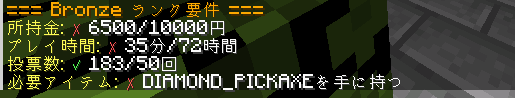

# ランクについて
経済鯖では、以下のようなランク制度を設けます。

ランクは、自動開放式にして、一部のランクは、条件に達したプレイヤーは自動的にランクを上昇させ、条件から外れたプレイヤーは、ランク減少とする。

## 使い方
1. `/rankcheck`を実行する。
2. 条件を確認する。

3. 条件に満たしていたら、ランクが付与される。

## ランクリスト
| ランク名 | 累計所持金 | 累計プレイ時間 | 累計投票回数 | 必要アイテム |
| --- | --- | --- | --- | --- |
| Beginner | 1000円 | 4時間 | 10回 | 鉄のツルハシ |
| Iron | 5000円 | 24時間 | 30回 |  |
| Bronze | 10000円 | 72時間 | 50回 | ダイヤのツルハシ |
| Silver | 50000円 | 168時間 | 72回 |  |
| Gold | 100000円 | 336時間 | 100回 | ネザライトのツルハシ |
| platinum | 300000円 | 672時間 | 130回 |  |
| diamond | 500000円 | 1344時間 | 150回 |  |
| master | 1000000円 | 2688時間 | 200回 |  |
| god | 10000000円 | 5000時間 | 300回 |  |

## 不名誉ランクリスト

| ランク名 | 付与理由 |
| --- | --- |
| Loser | 借金放置 |
| Dangerous | TempBanを受けたプレイヤー |