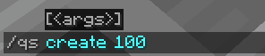
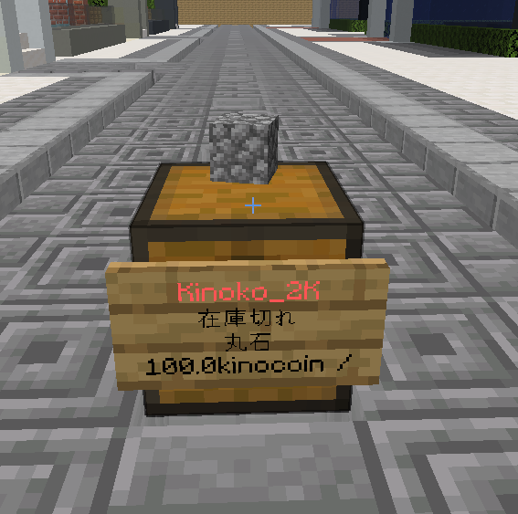
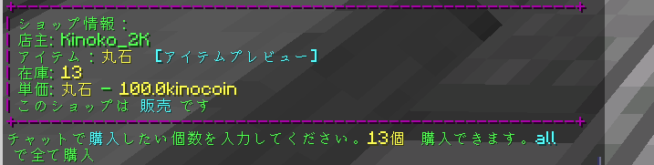
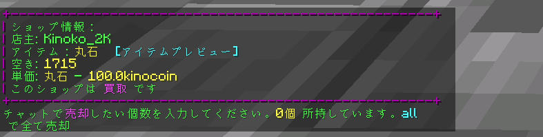
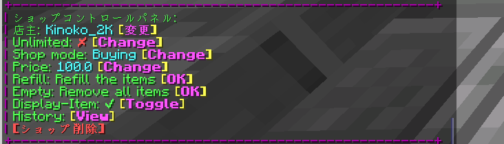

# ショップについて

## 作り方

1. 売りたいアイテムを手に持ちながら、チェストをカーソルに合わせて、/qs create [価格]を実行する。

2. 完成

3. 手に持ってるアイテムと同じアイテムを、チェストに入れることで在庫を増やすことができる。

## アイテムを買う方法

### 購入の場合

1. 他プレイヤーが作ったショップの看板を左クリックする。

2. この表示が出たら、【購入】なので、チャット欄に「2」と打つと、2個丸石を**買うこと**ができる。

### 売却の場合

1. 他プレイヤーが作ったショップの看板を左クリックする。

2. この表示が出たら、【売却】なので、チャット欄に「2」と打つと、2個丸石を**売ること**ができる。

## 自ショップの設定方法

* 自作ショップの看板を右クリック

- 店主
    - `/quickshop transferownership [mcid]`で他プレイヤーに、ショップを譲渡できる。
- Unlimited
    - 在庫を無限にする。OPのみ可能
- Shop Mode
    - 購入・売却モードを変更できる。
- Price
    - アイテムの値段
- Refill
    - アイテムの追加
- Empty
    - ショップの在庫を削除できる。
- Display-item
    - アイテムをチェストの上で表示する。削除すると見にくくなるが、サーバー的には良い。
- History
    - 購入・売却のログを表示する。
- ショップ削除
    - ショップを削除したい時に、クリックすると削除することができる。